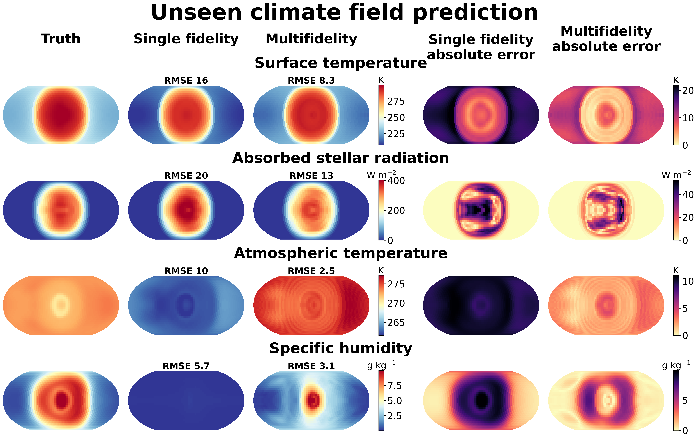
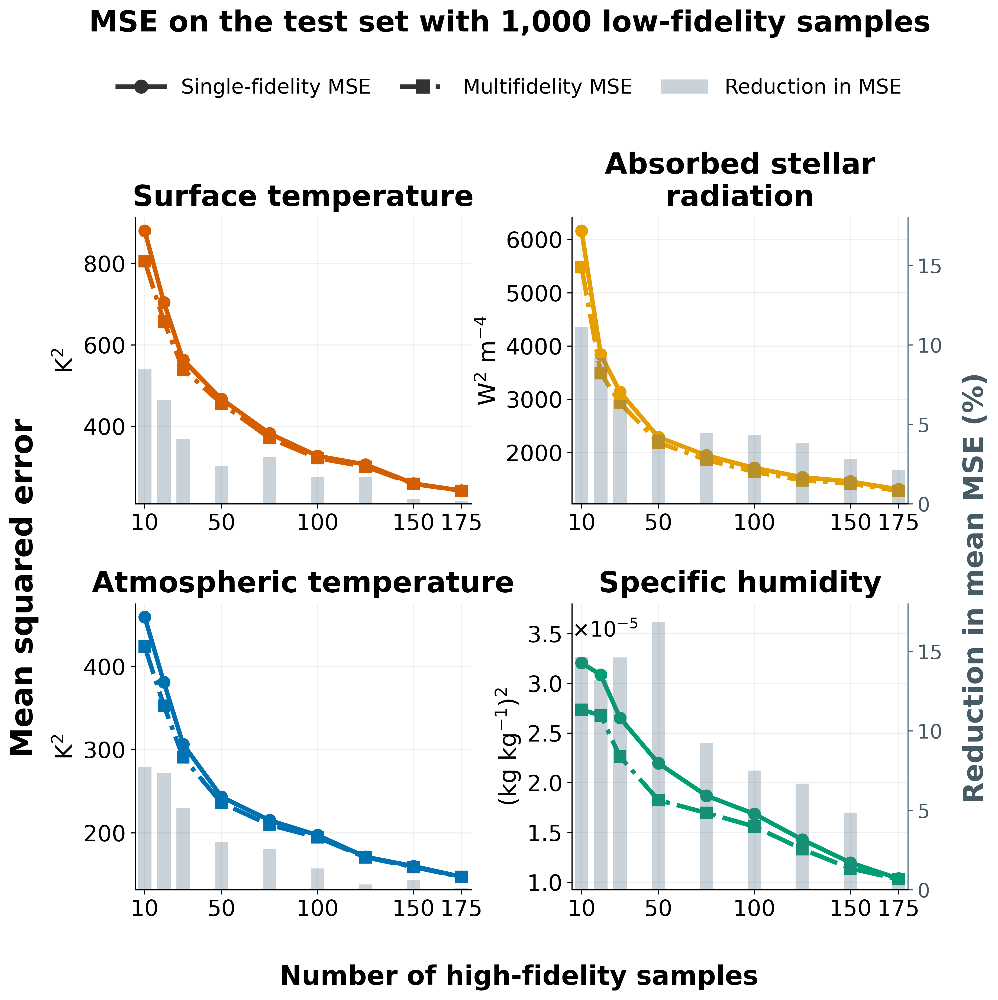

# Multifidelity Kernel Regression

A Python implementation of multifidelity kernel regression that combines high-fidelity and low-fidelity data to seek lower prediction error. This method adapts the nested correction used by Multifidelity Monte Carlo (MFMC) to kernel regression.

## Table of Contents

- [Motivation](#motivation)
- [Theory](#theory)
  - [Population-Optimal Alpha](#population-optimal-alpha)
  - [Comparison with the Same Single-Fidelity Estimator](#comparison-with-the-same-single-fidelity-estimator)
- [Results](#results)
  - [Exoplanet Climate Prediction](#exoplanet-climate-prediction)
- [Installation](#installation)
- [Prerequisites](#prerequisites)
- [Usage](#usage)
- [Project Structure](#project-structure)
- [Dependencies](#dependencies)
- [References](#references)

## Motivation

In many scientific and engineering applications, **high-fidelity data is expensive and scarce**. For example:
- High-resolution simulations require significant computational resources
- Physical experiments are costly and time-consuming
- Detailed measurements require expensive equipment

Standard kernel regression can have high prediction variance when high-fidelity
data is limited. This package incorporates cheaper low-fidelity data to reduce
that error when the correction is informative enough.

## Theory

At a query input $z$, let $f_H(z)$ be the high-fidelity target value.
Let $\widehat\mu_{H,n}(z)$ be the single-fidelity kernel prediction from $n$
high-fidelity observations. Let $\widehat\mu_{L,n}(z)$ and
$\widehat\mu_{L,m}(z)$ be low-fidelity kernel predictions from the first $n$
and all $m\ge n$ low-fidelity observations, respectively. The first $n$
inputs are paired across fidelities. For a coefficient $\alpha$, the
multifidelity prediction is

$$
\widehat\mu_{H,n}(z)
+\alpha\bigl(\widehat\mu_{L,m}(z)-\widehat\mu_{L,n}(z)\bigr).
$$

### Population-Optimal Alpha

For fixed $n$, $m$, and $z$, define the population mean squared error (MSE)
by averaging squared prediction error over random training sets:

$$
R(\alpha;z)=\mathbb E\left[
\left(\widehat\mu_{H,n}(z)-f_H(z)
+\alpha\bigl(\widehat\mu_{L,m}(z)-\widehat\mu_{L,n}(z)\bigr)\right)^2
\right].
$$

Assume that the high-fidelity prediction error and the low-fidelity
correction have finite second moments. Expanding the square gives

$$
\begin{aligned}
R(\alpha;z)
&=\mathbb E[(\widehat\mu_{H,n}(z)-f_H(z))^2]\\
&\quad+2\alpha\,\mathbb E[(\widehat\mu_{H,n}(z)-f_H(z))
(\widehat\mu_{L,m}(z)-\widehat\mu_{L,n}(z))]\\
&\quad+\alpha^2\mathbb E[(\widehat\mu_{L,m}(z)
-\widehat\mu_{L,n}(z))^2].
\end{aligned}
$$

If the final expectation is positive, differentiating with respect to
$\alpha$ and setting the derivative to zero gives

$$
\boxed{
\alpha_{\mathrm{MSE}}^*(n,m;z)
=-\frac{
\mathbb E[(\widehat\mu_{H,n}(z)-f_H(z))
(\widehat\mu_{L,m}(z)-\widehat\mu_{L,n}(z))]
}{
\mathbb E[(\widehat\mu_{L,m}(z)-\widehat\mu_{L,n}(z))^2]
}.}
$$

The second derivative is twice the positive denominator, so this
coefficient uniquely minimizes the population MSE. The expectations in the
formula are population quantities and generally must be estimated from data.

### Comparison with the Same Single-Fidelity Estimator

The single-fidelity comparator is $\widehat\mu_{H,n}(z)$ with the same $n$
high-fidelity observations. Its MSE is $R(0;z)$. When the low-fidelity
correction has a positive second moment, substituting the population-optimal
coefficient gives

$$
\begin{aligned}
R(\alpha_{\mathrm{MSE}}^*;z)
&=R(0;z)\\
&\quad-\frac{
\mathbb E[(\widehat\mu_{H,n}(z)-f_H(z))
(\widehat\mu_{L,m}(z)-\widehat\mu_{L,n}(z))]^2
}{
\mathbb E[(\widehat\mu_{L,m}(z)-\widehat\mu_{L,n}(z))^2]
}\\
&\le R(0;z).
\end{aligned}
$$

The subtracted fraction is nonnegative, so the population-optimal
multifidelity predictor has no greater expected MSE than this
single-fidelity predictor. If the low-fidelity correction has zero second
moment, the correction is zero almost surely and both predictors have the
same MSE. This statement concerns expected squared error over random
training sets and assumes the population-optimal coefficient is used.

## Results

### Exoplanet Climate Prediction

#### Climate field predictions



For each climate field, the single-fidelity and multifidelity predictors use
the same 150 high-fidelity simulations. The multifidelity predictor also uses
1,000 low-fidelity simulations. In the selected cases shown above, the
multifidelity predictions more closely reproduce the high-fidelity truth
for surface temperature, absorbed stellar radiation, atmospheric temperature,
and specific humidity.

#### Error reduction across training sets



The models were trained 100 times with different realizations of the training
data. With 1,000 low-fidelity simulations and up to 175 high-fidelity
simulations, multifidelity kernel regression achieved lower mean squared
error than single-fidelity kernel regression across all four climate fields.
The gray bars show the percentage reduction in mean squared error at each
high-fidelity sample count.

## Installation

```bash
# Clone the repository
git clone https://github.com/dkang339/mfkerreg.git
cd mfkerreg

# Install with uv (recommended)
uv sync

# Or install with pip
pip install -e .
```

## Prerequisites

Download data for the wing example.

Download the wing structural stress data from [here](https://link.springer.com/article/10.1007/s00158-022-03274-1#Sec23) (3.9 GB), or by running:

```bash
wget https://static-content.springer.com/esm/art%3A10.1007%2Fs00158-022-03274-1/MediaObjects/158_2022_3274_MOESM1_ESM.zip
```

Place the following data into `data/wing`:

```text
/data/crm_baseline_4DV_N1000_slim.h5
/data/crm_coarse-grid_4DV_N1000_slim.h5
/data/crm_coarse-ribs_4DV_N1000_slim.h5
```

Preprocess the data.

For each example, run the script beginning with `preproc_` to generate or format the data.

## Usage

```bash
# Run exponential function example
python examples/exponential/mfkr.py

# Run CRM wing stress-field example
python examples/wing/preproc_wing.py
python examples/wing/mfkr_field.py --low-fidelity grid
```

## Project Structure

```
mfkerreg/
├── src/
│   ├── kr.py          # Kernel regression implementation
│   ├── kernels.py     # Kernel functions (Matern, RBF, etc.)
│   ├── mfmc.py        # MFMC sample allocation
│   └── utils.py       # Utility functions
├── examples/
│   ├── exponential/   # 1D exponential function example
│   ├── wing/          # CRM wing stress-field example
│   └── exoplanet/     # UM and ExoPlaSim field experiments
├── optimal_mfkr_experiment/ # Influence-based allocation experiments
├── docs/              # Proofs and archived README
├── data/              # Precomputed statistics
├── README.md          # Current repository overview
└── mfkernel.pdf       # Theory document
```

## Dependencies

- numpy >= 2.4.1
- scipy >= 1.17.0
- matplotlib >= 3.10.8
- joblib >= 1.5.3
- h5py >= 3.15.1

## References

- Peherstorfer, B., Willcox, K., & Gunzburger, M. (2016). Optimal model management for multifidelity Monte Carlo estimation. *SIAM Journal on Scientific Computing*.
- Nadaraya, E. A. (1964). On estimating regression. *Theory of Probability & Its Applications*.
- Watson, G. S. (1964). Smooth regression analysis. *Sankhyā: The Indian Journal of Statistics*.
- NASA Common Research Model: https://commonresearchmodel.larc.nasa.gov/
- Perron, C., Sarojini, D., Rajaram, D., Corman, J., & Mavris, D. N. (2022). Manifold alignment-based multi-fidelity reduced-order modeling applied to structural analysis. *Structural and Multidisciplinary Optimization*, 65, 236. https://doi.org/10.1007/s00158-022-03274-1
