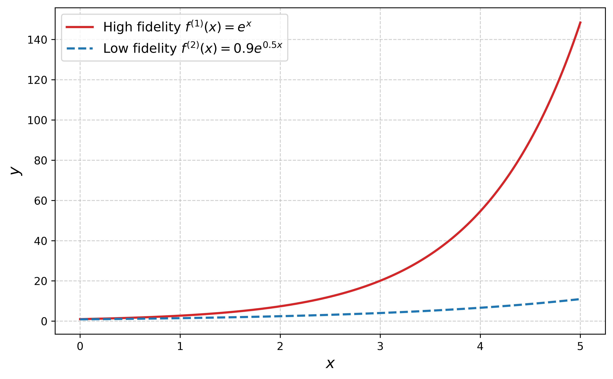
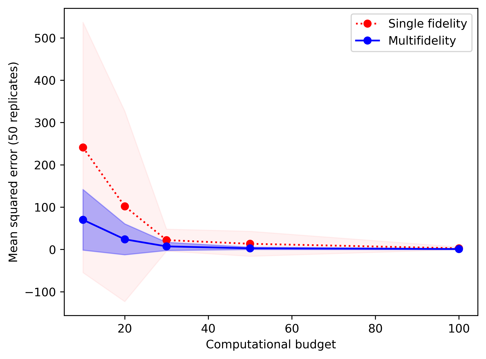
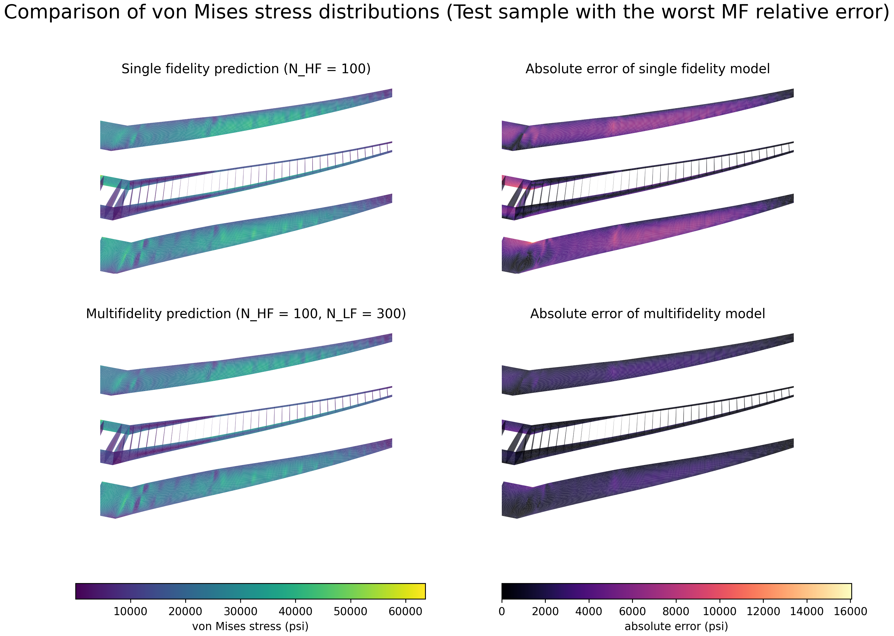

# Multifidelity Kernel Regression

A Python implementation of multifidelity kernel regression that combines high-fidelity and low-fidelity data to achieve variance reduction in predictions. This method applies the Multifidelity Monte Carlo (MFMC) estimator framework to kernel regression problems.

## Table of Contents

- [Motivation](#motivation)
- [Theory](#theory)
  - [Standard Kernel Regression](#standard-kernel-regression)
  - [Limitations of Standard Kernel Regression](#limitations-of-standard-kernel-regression)
  - [Multifidelity Setup](#multifidelity-setup)
  - [Multifidelity Kernel Regression](#multifidelity-kernel-regression)
- [Results](#results)
  - [Example 1: Exponential Function](#example-1-exponential-function)
  - [Example 2: NASA CRM Wing Stress Field](#example-2-nasa-crm-wing-stress-field)
- [Installation](#installation)
- [Prerequisites](#prerequisites)
- [Usage](#usage)
- [Project Structure](#project-structure)
- [Key Features](#key-features)
- [Dependencies](#dependencies)
- [References](#references)

## Motivation

In many scientific and engineering applications, **high-fidelity data is expensive and scarce**. For example:
- High-resolution simulations require significant computational resources
- Physical experiments are costly and time-consuming
- Detailed measurements require expensive equipment

Standard kernel regression often relies solely on high-fidelity data, leading to **high variance in predictions** when data is limited. This package addresses this limitation by incorporating cheaper low-fidelity data to improve prediction robustness.

## Theory

### Standard Kernel Regression

Kernel regression (also known as Nadaraya-Watson regression) is a non-parametric method that estimates the conditional expectation of a random variable. Given:

- $X \in \mathbb{R}^d$: d-dimensional input variable
- $f_1: \mathbb{R}^d \to \mathbb{R}$: high-fidelity input-output map
- $Y_1 = f_1(X)$: high-fidelity output variable
- $\lbrace (x_i, y_i) \rbrace_{i=1}^{n}$: n i.i.d. training samples

For an unseen point $x^\ast$, kernel regression predicts the output as a **weighted average of training data**:

$$E[Y_1|X=x^\ast] \approx \sum_{i=1}^{n} w_i(x^\ast) y_i$$

where the weights are computed using a kernel function $K_h$:

$$w_i(x^\ast) = \frac{K_h(x^\ast - x_i)}{\sum_{j=1}^{n} K_h(x^\ast - x_j)}$$

The kernel function $K_h(\cdot) = \frac{1}{h}K(\frac{\cdot}{h})$ must satisfy:
1. Non-negativity for all inputs
2. Integration to 1
3. Symmetry

Note that $\sum_{i=1}^{n} w_i = 1$, making this a proper weighted average.

### Limitations of Standard Kernel Regression

When high-fidelity data is limited:
- Predictions suffer from **high variance**
- The estimator is sensitive to the particular training samples drawn
- Accuracy degrades significantly in low-budget regimes

### Multifidelity Setup

To address these limitations, we introduce a **multifidelity framework**:

- $f_2: \mathbb{R}^d \to \mathbb{R}$: low-fidelity input-output map (cheap to evaluate)
- $n$: number of high-fidelity samples
- $m$ $(m \gg n)$: number of low-fidelity samples
- $\alpha$: optimal weight derived from correlation between fidelities

The key insight is that both kernel regression and the MFMC estimator are **mean estimation methods**, allowing us to combine them naturally.

### Multifidelity Kernel Regression

The MFMC estimator for mean estimation is:

$$\mathbb{E}[f_1(X)] \approx \frac{1}{n}\sum_{i=1}^{n} f_1(x_i) + \alpha \left( \frac{1}{m}\sum_{i=1}^{m} f_2(x_i) - \frac{1}{n}\sum_{i=1}^{n} f_2(x_i) \right)$$

Applying this framework to kernel regression:

$$E[Y_1|X=x^\ast] \approx \sum_{i=1}^{n} w_{i,n}(x^\ast) y^{(1)}_i + \alpha \left( \sum_{i=1}^{m} w_{i,m}(x^\ast) y^{(2)}_i - \sum_{i=1}^{n} w_{i,n}(x^\ast) y^{(2)}_i \right)$$

where:
- $w_{i,n}$ are weights computed using the $n$ high-fidelity samples
- $w_{i,m}$ are weights computed using the $m$ low-fidelity samples
- $\alpha$ is optimized to minimize variance

The estimator remains **unbiased** since the low-fidelity correction term has zero expectation:

$$E[Y^{(1)}|X=x^\ast] = E[Y^{(1)}|X=x^\ast] + \alpha \left( E[Y^{(2)}|X=x^\ast] - E[Y^{(2)}|X=x^\ast] \right)$$

## Results

### Example 1: Exponential Function

**Setup:**
- High-fidelity: $f_1(x) = e^x$
- Low-fidelity: $f_2(x) = 0.9e^{0.5x}$
- Input distribution: $x \sim \mathcal{U}(0, 5)$
- Correlation coefficient: 0.97
- Model evaluation cost (artificial): [1, 0.001]

**High-fidelity and Low-fidelity Functions:**



**Mean Squared Error Comparison:**

Multifidelity kernel regression achieves significantly lower MSE and variance, especially in low-budget regimes.



| Computational Budget | High-fidelity Samples ($n$) | Low-fidelity Samples ($m$) |
|---------------------|----------------------------|---------------------------|
| 10                  | 8                          | 1,126                     |
| 100                 | 88                         | 11,263                    |

### Example 2: NASA CRM Wing Stress Field

**Setup:**
- Input: NASA Common Research Model (CRM) wing design parameters
- High-fidelity output: CRM wing von Mises stress field
- Low-fidelity output: coarse-grid wing stress field
- Number of high-fidelity training samples: 100
- Number of low-fidelity training samples: 300
- Number of test samples: 100

In this example, the multifidelity kernel regression predicts POD coefficients
for unseen input points, then reconstructs the predicted stress field with the
high-fidelity POD basis.
To train the model, we use the MAROM framework from Perron et al. The method applies POD separately
to the high- and low-fidelity datasets and retains the same number of POD modes. It then
uses manifold alignment to map the low-fidelity POD coefficients into the high-fidelity
POD coefficient space.

**Stress Prediction and Pointwise Absolute Error:**



The absolute error distribution shows that the multifidelity prediction has
lower error than the single-fidelity prediction across the wing field.

For the coarse-grid low-fidelity data, multifidelity regression reduced the
mean relative L2 error from 4.04% with single-fidelity kernel regression to
2.34%. The worst-case relative L2 error also dropped from 19.55% to 8.80%.

| Method | Training Samples | Mean Relative L2 Error | Max Relative L2 Error |
|--------|------------------|------------------------|-----------------------|
| Single-fidelity KR | N_HF=100 | 4.04% | 19.55% |
| Multifidelity KR | N_HF=100, N_LF=300 | 2.34% | 8.80% |

## Installation

```bash
# Clone the repository
git clone https://github.com/yourusername/mfkerreg.git
cd mfkerreg

# Install with uv (recommended)
uv sync

# Or install with pip
pip install -e .
```

## Prerequisites

Download data for the wing example.

Download the wing structural stress data from [here](https://link.springer.com/article/10.1007/s00158-022-03274-1#Sec23) (3.9 GB), or by running:

```bash
wget https://static-content.springer.com/esm/art%3A10.1007%2Fs00158-022-03274-1/MediaObjects/158_2022_3274_MOESM1_ESM.zip
```

Place the following data into `data/wing`:

```text
/data/crm_baseline_4DV_N1000_slim.h5
/data/crm_coarse-grid_4DV_N1000_slim.h5
/data/crm_coarse-ribs_4DV_N1000_slim.h5
```

Preprocess the data.

For each example, run the script beginning with `preproc_` to generate or format the data.

## Usage

```bash
# Run exponential function example
python examples/exponential/mfkr.py

# Run CRM wing stress-field example
python examples/wing/preproc_wing.py
python examples/wing/mfkr_field.py --low-fidelity grid
```

## Project Structure

```
mfkerreg/
├── src/
│   ├── kr.py          # Kernel regression implementation
│   ├── kernels.py     # Kernel functions (Matern, RBF, etc.)
│   ├── mfmc.py        # MFMC sample allocation
│   └── utils.py       # Utility functions
├── examples/
│   ├── exponential/   # 1D exponential function example
│   └── wing/          # CRM wing stress-field example
├── data/              # Precomputed statistics
└── mfkernel.pdf       # Theory document
```

## Key Features

- **Variance Reduction**: Leverages cheap low-fidelity data to reduce prediction variance
- **Optimal Sample Allocation**: Automatically determines the optimal number of samples at each fidelity level
- **Unbiased Estimator**: Maintains unbiasedness while reducing variance
- **Kernels**: Supports ARD Matern 3/2 and Exponential kernel functions
- **Parallel Computation**: Uses joblib for parallel cross-validation

## Dependencies

- numpy >= 2.4.1
- scipy >= 1.17.0
- matplotlib >= 3.10.8
- joblib >= 1.5.3
- h5py >= 3.15.1

## References

- Peherstorfer, B., Willcox, K., & Gunzburger, M. (2016). Optimal model management for multifidelity Monte Carlo estimation. *SIAM Journal on Scientific Computing*.
- Nadaraya, E. A. (1964). On estimating regression. *Theory of Probability & Its Applications*.
- Watson, G. S. (1964). Smooth regression analysis. *Sankhyā: The Indian Journal of Statistics*.
- NASA Common Research Model: https://commonresearchmodel.larc.nasa.gov/
- Perron, C., Sarojini, D., Rajaram, D., Corman, J., & Mavris, D. N. (2022). Manifold alignment-based multi-fidelity reduced-order modeling applied to structural analysis. *Structural and Multidisciplinary Optimization*, 65, 236. https://doi.org/10.1007/s00158-022-03274-1
